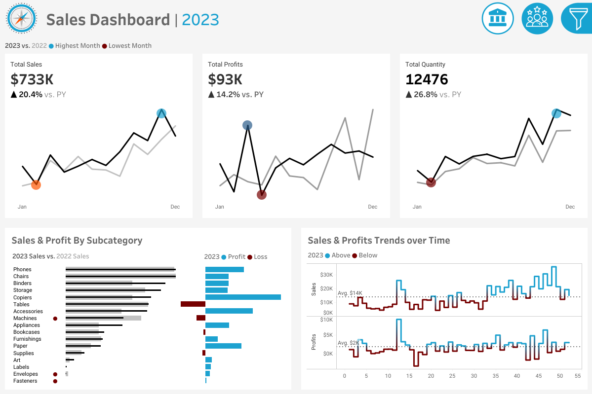

# sales-customer-dashboard-tableau
Building two dashboards using Tableau to help stakeholders, including sales managers and executives, analyze sales performance and customer behavior.

# 📊 Sales & Customer Dashboard (Tableau)

This Tableau dashboard analyzes year-over-year sales performance and customer trends.

✅ Metrics included:
- CY vs PY Sales
- CY vs PY Customers
- Weekly profit trends
- Top 10 customers

🔗 **[View Dashboard on Tableau Public](https://public.tableau.com/app/profile/ashfaq.ahmed5098/viz/SalesCustomerDashboard_17499708226800/SalesDashboard)**

